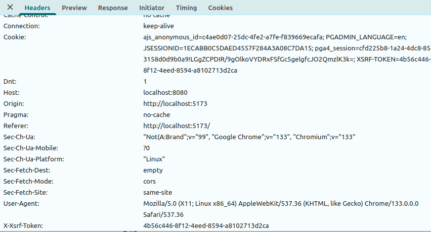

## Ejemplo Heladería para PHM

[](https://github.com/uqbar-project/eg-heladeria-react-phm/actions/workflows/build.yml)


En este ejemplo mostramos un frontend en React que maneja **autenticación** mediante JWT (JSON Web Token). Además utiliza

- [Tailwind](https://tailwindcss.com/) como biblioteca de css
- [TanStack Router](https://tanstack.com/router/latest) como biblioteca de routing en lugar de React Router

## Vistas

La aplicación es sencilla y consta de las siguientes vistas

- '/' o home: es la página principal donde se muestra la lista de heladerías
- '/editarHeladeria/$id': donde podemos editar la información de una heladería (el nombre, el tipo de heladería, la persona responsable y gustos que fabrica)

Además, dado que se espera que los endpoints de [nuestro backend](https://github.com/uqbar-project/eg-heladeria-springboot-kotlin) estén securizados, sumamos una pantalla de Login ('/login) que permite ingresar usuario y contraseña. 

## Cómo funciona la autenticación

En la pantalla de login, ingresamos usuario y password y enviamos esa información al backend, que valida y nos dará

- un error 401 si las credenciales son inválidas

```json
{
    "timestamp": "2025-03-02T15:16:24.591+00:00",
    "status": 401,
    "error": "Unauthorized",
    "message": "Las credenciales son inválidas",
    "path": "/login"
}
``` 

- o bien un 200 con el string que representa el token. Ese token se almacena dentro del local storage del navegador:


Y de paso, redirigimos la página hacia el lugar donde queremos ir. Esto permite que si escribimos

```bash
http://localhost:5173/editarHeladeria/2
```

nos lleve

- primero al login si no estamos autenticados

```ts
// archivo routes.ts
export const onBeforeLoad = () => {
  const isLoggedIn = localStorage.getItem(TOKEN_KEY) !== null
  if (!isLoggedIn) {
    throw redirect({
      to: '/login',
      search: {
        redirect: location.pathname,
      },
    })
  }
}
```

- y después redirija la navegación a `/editarHeladeria/$id` que fue guardado dentro de la clave `search/redirect`

```ts
// archivo login/index.tsx
const login = async (event: React.MouseEvent<HTMLButtonElement, MouseEvent>) => {
  try {
    event.preventDefault()
    const token = await loginUser(usuario, password)
    localStorage.setItem(TOKEN_KEY, token)  // <== guardamos en el local storage el token
    router.history.push(search.redirect ?? '/')
  } catch (e: unknown) {
    const errorMessage = getErrorMessage(e as AxiosError)
    setErrorMessage(errorMessage)   // <== acá manejamos cuando se ingresan credenciales inválidas
    console.error(e)
  }
}
```

## Qué pasa cuando la sesión vence

El comportamiento común de un usuario es que comienza a utilizar una aplicación y luego necesita hacer otras cosas. Cuando vuelve a querer utilizar el sistema, es probable que haya pasado un tiempo razonable y el token que tengamos almacenados ya no sea válido (**es una buena práctica que el token sirva por 10/20/30 minutos, no más**). En ese caso el servidor valida el request y al detectar que está vencido devuelva un error 401, con un mensaje similar a "Sesión vencida":

```json
{
    "timestamp": "2025-03-02T15:37:44.036+00:00",
    "status": 401,
    "error": "Unauthorized",
    "message": "Sesión vencida",
    "path": "/heladerias/3"
}
```

En el archivo de routing definimos un handler específico para estos casos:

```ts
// errors.ts
export const isSessionExpired = (error: AxiosError) => error.status === HttpStatusCodes.UNAUTHORIZED

// routes.ts
export const onErrorRoute = (error: AxiosError) => {
  if (isSessionExpired(error)) {
    // eliminamos el token vencido
    localStorage.removeItem(TOKEN_KEY)
  }
}
```

## Envío del token en cada request

En el ejemplo tenemos una función para manejar cada request, aquí aprovechamos la oportunidad para enviar 

1. el **token** con las credenciales (Bearer token), que tenemos en nuestro local storage


2. pero también recibimos con cada **response** del server una cookie que trae otro token, el que evita que nos hagan CSRF. 


Lo que nosotros hacemos es tomar esa entrada XSRF-TOKEN de la cookie e inyectarla en el header de la siguiente request. La clave es "X-XSRF-TOKEN", y para hacer eso necesitamos decirle a axios que traiga las credenciales (`withCredentials`). Si bien esta configuración va a deprecarse en favor de `withXSRFToken`, por el momento la necesitamos.



El server recibe ese token para las operaciones con efecto como la actualización de la heladería y eso permite que todo funcione correctamente.

```ts
// archivo common.ts
export async function httpRequest<T>(request: AxiosRequestConfig): Promise<T> {
  const token = localStorage.getItem(TOKEN_KEY) ?? ''
  const headers = request.headers as AxiosHeaders ?? new AxiosHeaders()
  headers.setAuthorization(`Bearer ${token}`)
  const okRequest = {
    ...request,
    headers,
    withXSRFToken: true,
    withCredentials: true,
    xsrfHeaderName: 'X-XSRF-TOKEN',
    xsrfCookieName: 'XSRF-TOKEN',
  }
  const response = await axios(okRequest)
  return response.data
}
```

